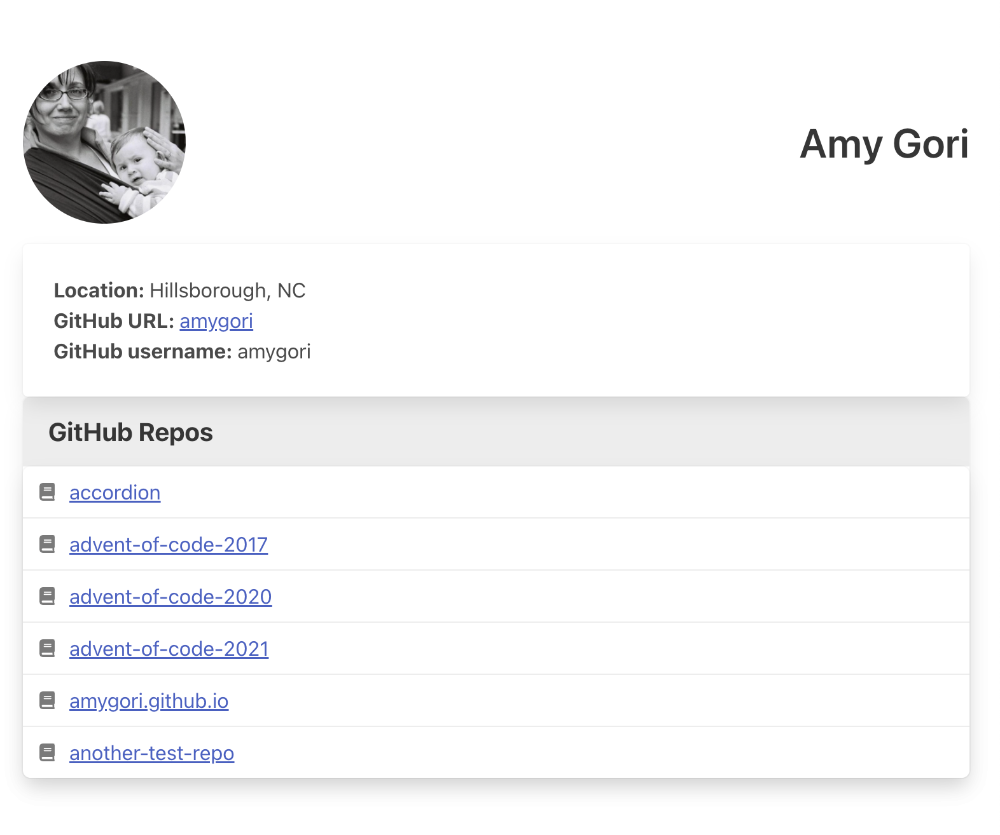

# GitHub Bio Site

## Directions

In today's project, you'll be asked to not only write code to make live Ajax requests, but also write some HTML and CSS to bring a mockup to life.

Using the mockup below as a guide and using the GitHub API, retrieve data about yourself from the GitHub API to create a profile page that shows information and a list of your repos.

All of the data about you, including your name and your GitHub username, should be retrieved from the GitHub API.

Make sure to get your avatar url fromGitHub and use it as an avatar on the page. Your username and the names of your repos should be links that work.

You do _not_ have to include the font icon for each repo, but if you want to, you can use the Font Awesome library. You can include it in your project by adding the link to the stylesheet in your the `<head>` tag in your HTML:

```html
  <link rel="stylesheet" href="https://cdnjs.cloudflare.com/ajax/libs/font-awesome/6.0.0/css/all.min.css" />
```

You are welcome to style this however you like and use any additional data you want to from the GitHub API. You don't have to reproduce this mockup exactly, but you should have all the same data included.



## Hints

Since there are no starter files provided, you'll need to create your own HTML, CSS, and JavaScript files and link them together properly. Before you start writing any JavaScript, we suggest you spend time examining the GitHub API docs listed below to get familiar with how you can obtain the data.

The URL that will give you the initial data about your GitHub profile is:

```http
https://api.github.com/users/your-username-here
```
Note that

In your HTML you will need a basic structure to add onto with the JS code. Once you have some HTML in place, begin setting up your AJAX calls and the callback functions to work with the data you retrieve. Don't forget to console.log the data to check what you're getting back.

Insomnia will be helpful to test the AJAX calls as you get started.

## Resources

- [Mockup](mockup.png)
- [GitHub User API](https://api.github.com/users/username) - change `username` in this url to your own username
- [GitHub API Docs](https://docs.github.com/en/rest)
- [Insomnia Download](https://insomnia.rest/download)
- [Getting Started with Insomnia](https://support.insomnia.rest/article/11-getting-started)
